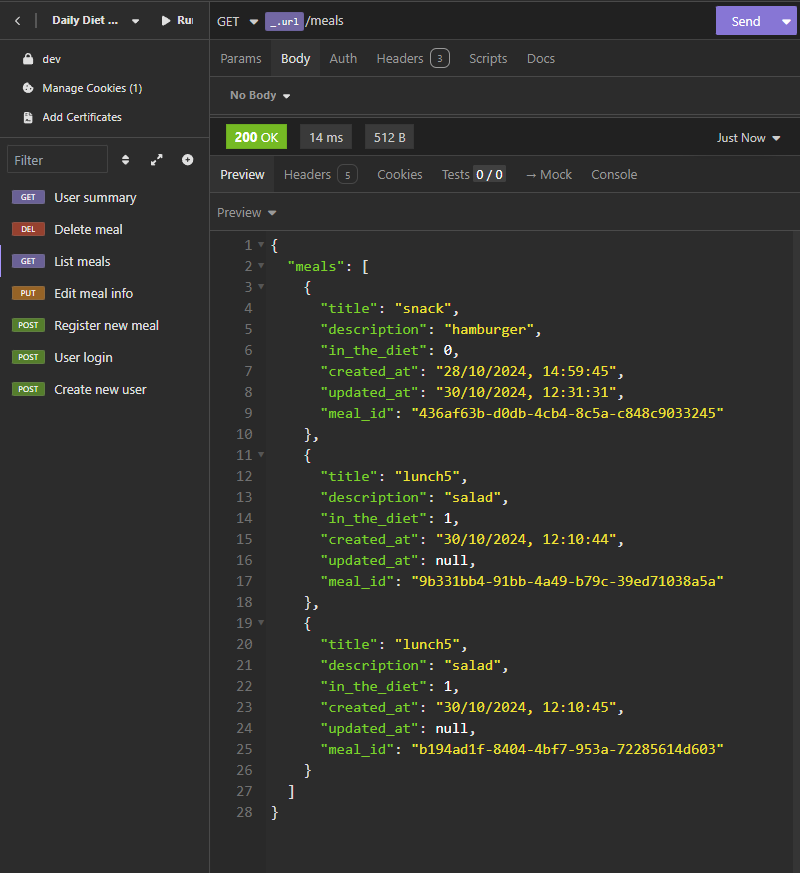

# Daily Diet - Node Restful API



## Sumário

- [Bibliotecas](#bibliotecas)
  - [Dependências](#dependencias)
  - [Dependências de desenvolvimento](#dependencias-de-desenvolvimento)
- [Requisitos da aplicação](#requisitos-da-aplicacao)
- [Funcionalidade](#funcionalidade)
- [Rotas](#rotas)
  - [POST - Criar usuário](#post---criar-usuário)
  - [POST - Login](#post---login)
  - [GET - Visualizar os dados pessoais](#get---visualizar-os-dados-pessoais)
  - [POST - Registrar nova refeição](#post---registrar-nova-refeição)
  - [PUT - Editar os dados de uma refeição](#put---editar-os-dados-de-uma-refeição)
  - [DELETE - Deletar uma refeição](#delete---deletar-uma-refeição)
  - [GET - Listar refeições](#get---listar-refeições)
  - [GET - Visualizar uma refeição](#get---visualizar-uma-refeição)
  - [GET - User Summary](#get---user-summary)
- [Como rodar o projeto](#como-rodar-o-projeto)
- [Autor](#autor)

## Bibliotecas

### Dependências

- [Fastify](https://fastify.dev): Framework web para Node.js usado para criar APIs e servidores HTTP (similar ao Express.js) e possio suporte à tipagem TypeScript.

- [Knex](https://knexjs.org): **SQL query builder** utilizado para simplificar a linguagem sql. É um construtor de queries, que facilita a escrita do código usando javascript. Similar a um ORM.

- [dotenv](https://www.npmjs.com/package/dotenv): Dotenv carrega variáveis ambiente de um arquivo .env ao `process.env` em aplicações Node.js.

- [zod](https://zod.dev/): Biblioteca de validação de esquemas e dados, garantindo a segurança dos dados.

- [Fastify-type-provider-zod](https://github.com/turkerdev/fastify-type-provider-zod): Integra o **Zod** com o **Fastify**, permitindo validar e tipar dados das requisições HTTP para evitar erros. Usa validações do Zod para definir e validar o `body`, `params`, `query` e `headers` das requisições.

- [@fastify/cookie](https://github.com/fastify/fastify-cookie): Um plugin para o Fastify que adiciona suporte para ler e definir cookies.

- [pg](https://node-postgres.com): Driver do banco de dados do PostgreSQL.

- [@fastify/cors](https://github.com/fastify/fastify-cors): Plugin do Fastify que configura o CORS (Cross-Origin Resource Sharing), uma medida de segurança que limita o acesso ao backend, permitindo apenas frontends específicos.

### Dependências de desenvolvimento

- [ESLint](https://eslint.org/): Ferramenta para análise de código, responsável por identificar erros e inconsistências, como variáveis não utilizadas ou não declaradas.

- [Prettier](https://prettier.io/): Ferramenta de formatação de código como indentação, espaçamento, uso de aspas simples ou duplas, etc, garantindo consistência no estilo do código.

- [Vitest](https://vitest.dev): Um framework de test nativo do vite, mas mais rápido que Jest. Apesar disso, a migração do Jest ao Vitest é simples, pois a sintaxe é extremamente similar.

- [tsx](https://tsx.is): TSX significa _Typescript Execute_, servindo como um executor node para rodar código Typescript.

- [Supertest](https://www.npmjs.com/package/supertest): A motivação com este módulo é fornecer uma abstração de alto nível para testar HTTP, ao mesmo tempo que permite acessar a API de nível inferior fornecida pelo `superagent`. Ou seja, testar o servidor sem precisar rodá-lo em uma porta específica, evitando conflitos.

- [tsup](https://tsup.egoist.dev): Ferramenta para otimizar projetos TypeScript, permitindo realizar o build (converter TS em JS) de forma eficiente. Além disso, assim como Vitest e TSX, ele utiliza o **esbuild**, que acelera processos e facilita o desenvolvimento com TypeScript de maneira moderna.

## Requisitos da aplicação

- [ X ] Deve ser possível criar um usuário

  - name
  - email
  - user_id
  - password
  - repeat_password
  - session_id

- [ X ] Deve ser possível identificar o usuário entre as requisições
- [ X ] Deve ser possível registrar uma refeição feita, com as seguintes informações: _As refeições devem ser relacionadas a um usuário._

  - meal_id
  - user_id
  - title
  - description
  - in_the_diet (Está dentro ou não da dieta)
  - created_at (Data e hora)
  - updated_at

- [ X ] Deve ser possível listar todas as refeições de um usuário
- [ X ] Deve ser possível editar uma refeição, podendo alterar todos os dados acima
- [ X ] Deve ser possível apagar uma refeição
- [ X ] Deve ser possível visualizar uma única refeição
- [ X ] Deve ser possível recuperar as métricas de um usuário

  - Quantidade total de refeições registradas
  - Quantidade total de refeições dentro da dieta
  - Quantidade total de refeições fora da dieta
  - Melhor sequência de refeições dentro da dieta

- [ X ] O usuário só pode visualizar, editar e apagar as refeições o qual ele criou

## Rotas

### POST - Criar usuário

- Rota: `"/users"`
- Método: `POST`
- Objetivo: Criar novo usuário

```ts
// Criptografando a senha antes de adicioná-la ao banco.
const salt = await bcrypt.genSalt(12);
const passwordHash = await bcrypt.hash(password, salt);

// O session_id por enquanto não é definido e só será durante a realização do login.
await knex<IUser>("users").insert({
  email,
  name,
  password: passwordHash,
  user_id: randomUUID(),
});
```

### POST - Login

- Rota: `"/login"`
- Método: `POST`
- Objetivo: Realizar o login do usuário para que possa cadastrar refeições

Utilizado sistema de login para atenticar usuários.
Atualizando o `session_id` para um `id` válido e o enviando para os `cookies` através do [@fastify/cookie](https://github.com/fastify/fastify-cookie).

```ts
let sessionId = req.cookies.session_id;

if (!sessionId) {
  sessionId = randomUUID();

  res.cookie("session_id", sessionId, {
    path: "/",
    maxAge: 60 * 60 * 24, // 1 day - O maxAge define em segundos a duração do cookie.
  });
}

await knex<IUser>("users").select().where("email", email).update({
  session_id: sessionId,
});
```

### GET - Visualizar os dados pessoais

- Rota: `"/users/profile"`
- Método: `GET`
- Objetivo: Permitir ao usuário visualizar seu nome e email cadastrados

A partir daqui todas as rotas verificam a presença da `session_id` nos cookies para permitir que o usuário crie, delete ou edite informações.

Middleware para verificação da existência de um `session_id`:

```ts
  const sessionId = req.cookies.session_id;

  if (!sessionId) return res.status(401).send({ message: "Unauthorized" });

  done();
};
```

Função que avalia se o `session_id` atual nos cookies bate com o registrado nos dados do usuário no banco.

```ts
const sessionId = req.cookies.session_id;

const userLogged = await knex<IUser>("users")
  .where({
    session_id: sessionId,
  })
  .first();

if (!userLogged) return res.status(401).send({ message: "Unauthorized" });
```

Dando tudo correto, o usuário pode visualizar os seus dados.

```ts
const sessionId = req.cookies.session_id;

if (!sessionId) return res.status(401).send({ message: "Unauthorized!" });

const userData = await knex<IUser>("users")
  .select("email", "name")
  .where({ session_id: sessionId })
  .first();

if (!userData) return res.status(404).send({ message: "User not found!" });

return res.status(200).send({ user: userData });
```

### POST - Registrar nova refeição

- Rota: `"/meals"`
- Método: `POST`
- Objetivo: Criar nova refeição feita

```ts
await knex<IMeal>("meals").insert({
  user_id: user?.user_id,
  meal_id: randomUUID(),
  title,
  description,
  in_the_diet: inTheDiet,
  created_at: currentDate,
});
```

### PUT - Editar os dados de uma refeição

- Rota: `"/meals/:meal_id"`
- Método: `PUT`
- Objetivo: Editar os dados de uma refeição

Para que o usuário tenha permissão para alterar um dado, precisamos verificar se a refeição registrada possui o id do usuário logado. Dessa forma evitamos que outros usuários editem dados que não são seus.

```ts
const userCanEditMeal = await knex<IMeal>("meals")
  .where({
    meal_id: mealId,
  })
  .andWhere({ user_id: userLogged.user_id })
  .first();

if (!userCanEditMeal) return res.status(401).send({ message: "Unauthorized" });
```

As permissões sendo totalmente autorizadas, o usuário pode atualizar os dados e o campo `updated_at` é atualizado para a data atual:

```ts
const currentDate = new Date().toLocaleString("pt-BR");

await knex<IMeal>("meals")
  .where({ meal_id: mealId })
  .update({ updated_at: currentDate, ...updates });
```

### DELETE - Deletar uma refeição

- Rota: `"/meals/:meal_id"`
- Método: `DELETE`
- Objetivo: Deletar uma refeição

Após todas as verificações demonstradas anteriormente e o usuário tendo permissão de deletar uma refeição, ela é removida do banco de dados, com uma requisição simples ao banco de dados:

```ts
export const deleteMeal = async ({ res, mealId }: IDeleteMeal) => {
  await knex<IMeal>("meals").where({ meal_id: mealId }).delete();

  return res.status(204).send();
};
```

### GET - Listar refeições

- Rota: `"/meals"`
- Método: `GET`
- Objetivo: Listar todas as refeições de um usuário

```ts
const meals = await knex<IMeal>("meals")
  .where({ user_id: userLogged.user_id })
  .select(
    "title",
    "description",
    "in_the_diet",
    "created_at",
    "updated_at",
    "meal_id"
  );
```

### GET - Visualizar uma refeição

- Rota: `"/meals/meal_id"`
- Método: `GET`
- Objetivo: Listar uma refeição específica de um usuário pelo id

```ts
const { user_id, ...rest }: IMeal = validMeal; // removing user_id
const meal = { ...rest, in_the_diet: 1 ? true : false }; // changing the return of in_the_diet to true or false instead of 1 or 0

return res.status(200).send({ meal });
```

O banco de dados registra dados como `true` ou `false` como 1 e 0, respectivamente. Assim só foi necessário mudar isso antes de ser enviado como resposta ao Frontend.

### GET - User Summary

- Rota: `"/summary"`
- Método: `GET`
- Objetivo: Listar um resumo do usuário, incluindo:
  - Quantidade total de refeições registradas
  - Quantidade total de refeições dentro da dieta
  - Quantidade total de refeições fora da dieta
  - Melhor sequência de refeições dentro da dieta

Essa última rota exigiu um pouco mais de lógica.

- **Quantidade total de refeições dentro e fora da dieta**: As refeições nos retornam a informação `in_the_diet` que pode ser `true` ou `false`. Assim só precisamos utilizar o método `filter` para verificar quais estão dentro ou fora da dieta.

```ts
const { user_id }: IUser = user;

const mealsData = await knex<IMeal>("meals").select().where({
  user_id,
});

const mealsInTheDiet = mealsData.filter((meal) => meal.in_the_diet).length;
const mealsOutTheDiet = mealsData.filter((meal) => !meal.in_the_diet).length;
```

- **Melhor sequência de refeições dentro da dieta**: Aqui precisamos avaliar quantas refeições dentro da dieta o usuário teve em sequência. Utilizando o método `map()` conseguimos percorrer todas as refeições na ordem de registro ao banco de dados. Assim, foi utilizado esta função para registrar a sequência:

```ts
const bestDietSequency = (): number => {
  let bestSequency = 0; // A melhor sequência
  let currentSequency = 0; // A sequência atual percorrida pelo método map

  mealsData.map((meal) => {
    if (meal.in_the_diet) {
      currentSequency++; // Quando a refeição atual está dentro da dieta, a sequência atual aumenta
      if (currentSequency > bestSequency) bestSequency = currentSequency; // Se a melhor sequência é menor que a atual, a melhor é atualizada
    } else if (!meal.in_the_diet) {
      currentSequency = 0; // Se a refeição atual está fora da dieta, a sequência atual é resetada e reinicia do zero.
    }
  });
  return bestSequency; // Após percorrermos por todas as refeições do usuário, é retornado a melhor sequência.
};
```

```json
{
  "summary": {
    "mealsRegistered": 3,
    "mealsInTheDiet": 2,
    "mealsOutTheDiet": 1,
    "bestDietSequency": 2
  }
}
```

- **Quantidade total de refeições registradas**: Só precisamos coletar todas as refeições registradas com o id do usuário e coletar a `lenght`.

Resultado:

```ts
const summary = {
  mealsRegistered: mealsData.length,
  mealsInTheDiet,
  mealsOutTheDiet,
  bestDietSequency: bestDietSequency(),
};

return res.status(200).send({ summary });
```

## Como rodar o projeto

- Instalar as dependências `npm install`
- Criar o arquivo `.env` e `.env.test` caso queira realizar os testes `e2e` da aplicação. Configure as variáveis ambiente como demonstra o arquivo `.env.example` e `.env.test.example`.
- Executar as migrations `npm run knex migrate:latest`
- Executar o servidor `npm run server`

## Autor

- GitHub - [Felipe Santiago Morais](https://github.com/SantiagoMorais)
- Linkedin - [Felipe Santiago](https://www.linkedin.com/in/felipe-santiago-873025288/)
- Instagram - [@felipe.santiago.morais](https://www.instagram.com/felipe.santiago.morais)
- Email - <a href="mailto:contatofelipesantiago@gmail.com" target="blank">contatofelipesantiago@gmail.com</a>
- <a href="https://api.whatsapp.com/send?phone=5531996951033&text=Hi%2C%20Felipe%21%20I%20got%20your%20contact%20from%20your%20portfolio.">Whatsapp</a>
